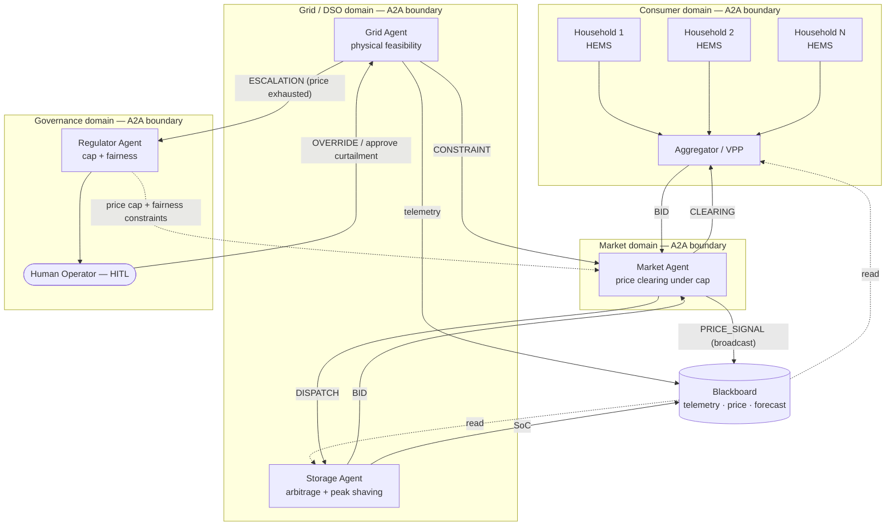
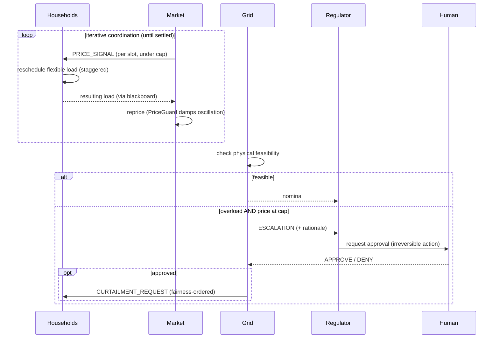

# Architecture & Agent Roster

## Diagram

The four subgraphs are **A2A trust boundaries** (separate organizations). Tool
and data access *inside* an agent is the **MCP boundary**.

## Control flow (one episode)

## Agent roster (detail)

| Agent | Trust domain | Responsibilities | Tools (MCP) | Memory | Permissions |
|---|---|---|---|---|---|
| Household (HEMS) | consumer | minimize cost s.t. comfort/deadline; respond to price | smart meter, HVAC/EV/water-heater control, local PV+battery | usage pattern, comfort range, EV schedule | `control:self_devices` (own devices only; no access to other homes) |
| Aggregator / VPP | consumer | bundle homes, bid to market, relay price, preserve privacy | aggregate of homes, market API | aggregate flexibility, contracts | `submit:aggregate_bid`, `relay:price` (aggregate-only; cannot force a home) |
| Grid (DSO) | grid | guarantee physical feasibility; issue constraints; escalate | SCADA/telemetry, constraint publishing | topology, capacity limits, load history | `issue:constraint`, `request:curtailment`, `escalate` (no direct device control) |
| Storage | grid | arbitrage + grid services (peak shaving) | BMS charge/discharge, bidding | SoC, degradation, price history | `control:self_battery`, `submit:bid` (within SoC/degradation limits) |
| Market | market | run the auction; clear price under the cap; broadcast | bid aggregation, clearing | bid history, elasticity estimate | `set:price`, `broadcast:price` (cap-bounded) |
| Regulator + Human | governance | enforce cap + fairness; approve/override; audit | policy injection, override, audit log | regulations, audit records | `set:price_cap`, `override:market`, `approve:curtailment` |

### Why Grid and Market are separate agents

If one agent owned both economics and physics, an overloaded-but-cleared schedule
would be invisible — there would be no internal disagreement to surface. By
splitting them, the *market clears* and the *grid vetoes/escalates*, which gives
us a natural escalation trigger, a clean human-in-the-loop chokepoint, and a clear
audit boundary. This separation is the backbone of the coordination, emergence,
and safety designs.
